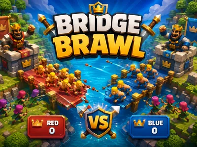
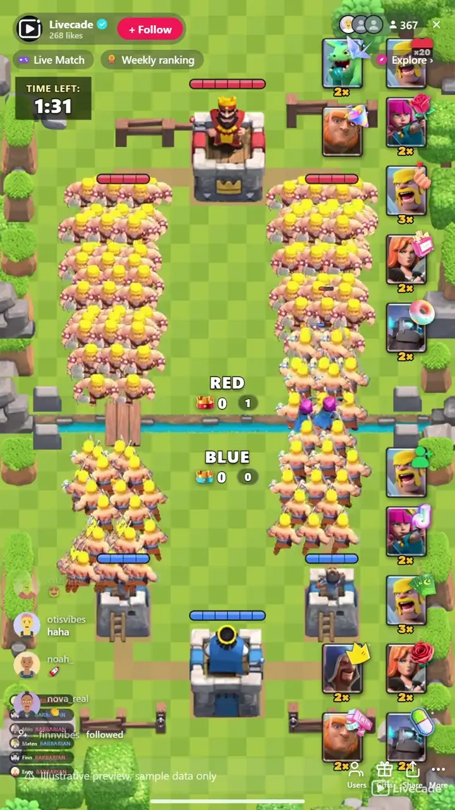

# Bridge Brawl - Interactive TikTok Live Game

> A Clash Royale style arena battle where your chat sends the troops.

A Clash Royale style arena battle where your viewers are the ones deploying the troops. Two bridges, six towers, three crowns to win, and every barbarian, archer and dragon on the board was paid for by someone in your chat.

**[Play Bridge Brawl on Livecade](https://livecade.io/games/bridge-brawl/?utm_source=github&utm_medium=readme&utm_campaign=bridge-brawl)** - runs as a single browser source in OBS, Streamlabs, or TikTok LIVE Studio. Nothing for viewers to install.

## How viewers play

Viewers take part with the actions TikTok already gives them: **gifts**, **likes**, **follows**, **shares**. Every action below is rebindable, so you decide which interaction drives which effect.

| Action | What it does |
| --- | --- |
| **Barbarian** | A squad of five melee fighters, the cheap way to flood a lane |
| **Archer** | A pair of ranged attackers that can shoot air units down |
| **Baby dragon** | Flies over the ground war and only ranged troops can stop it |
| **Wizard** | Splash damage that clears a packed lane in one shot |
| **Mini pekka** | Fast, fragile and hits hard, the tower breaker |
| **Valkyrie** | Tanky melee that holds a bridge against a crowd |
| **Giant** | Slow, huge health pool, walks through fire toward the towers |

## How it works

### Every troop is a gift someone sent

Seven troops, each bound to whichever gift, like, follow or share you choose. Set how many a single trigger sends, so one gift can drop a lone giant or a wave of barbarians.

### Air beats ground, archers beat air

The baby dragon flies over the whole ground army and only archers, wizards and towers can touch it. Ground troops fight what is in front of them. Counters actually matter, so chat learns what to send.

### Three crowns ends it

Two crown towers and a king per side. The king stays silent until one of its crown towers falls, then wakes up for the last stand. Drop the king and the match ends immediately.

## About the game

Bridge Brawl is a Clash Royale style tower battle built for TikTok Live, with one difference that changes everything: nobody plays it with a deck. Your viewers are the deck. Red holds the top of the arena, blue holds the bottom, and every troop that walks a lane got there because someone in chat sent the gift bound to it. You are not playing against your audience, you are hosting the war between them.

### Seven troops, each on its own gift

Barbarians, archers, a baby dragon, a wizard, a mini pekka, a valkyrie and a giant, each bound to whichever gift you choose and each with real stats behind it. Ground troops walk their lane and fight whatever they meet; the baby dragon flies straight over the melee, so only archers, wizards and the towers themselves can bring it down. A viewer picking a dragon over a barbarian is making an actual tactical call, not just choosing a picture.

### Crowns, kings and a clock

Each side defends two crown towers and a king. Take a crown tower and you bank a crown; take the king and the match ends on the spot. The king does not fire until one of its own crown towers has fallen, which turns the last stretch of every match into a real last stand. When the clock runs out the side with more crowns wins, and a tie falls to whoever did more tower damage, so a losing side that chipped away all match still has something to show for it.

### It never sits empty

An auto-fill trickle keeps a minimum number of troops on the board when the room is quiet, so a viewer arriving mid-match finds a battle already running rather than an empty field, and it backs off the moment real gifts start landing. Matches run as long as you set them and restart on their own, so the arena is always mid-fight when someone new walks in.

## What it looks like on stream

[Watch Bridge Brawl gameplay](https://cdn.livecade.io/games/bridge-brawl.mp4)

## What you can configure

- **Interface language** - Twelve languages for the on-screen chrome
- **Side names** - Rename Red and Blue to whatever rivalry you are running
- **Match length** - One to sixty minutes per match, plus the pause before the next one
- **Tower health and firepower** - Tune how long a tower survives and how hard it hits back
- **Unit speed** - Speed the whole battle up or slow it down
- **Maximum troops per side** - How crowded the arena is allowed to get
- **Keep the battle going on its own** - A trickle of free troops when the room is quiet, off the moment real gifts land

## Languages

English, Spanish, Portuguese, French, German, Italian, Indonesian, Arabic, Turkish, Russian, Hindi, Romanian

## FAQ

<strong>Is Bridge Brawl like Clash Royale?</strong>

It is built in the same shape: two lanes, two bridges, crown towers, a king tower and a three crown win. The difference is who plays it. There is no deck and no elixir, because the troops come from your viewers sending gifts, so the whole audience is playing one side instead of one person playing a hand.

<strong>How do viewers send troops?</strong>

Every troop is bound to a trigger you choose, usually a gift, and can also be a like streak, a follow or a share. Send the gift, the troop walks out of your side of the arena with the sender credited on screen. You set how many troops one trigger sends.

<strong>How does a side win?</strong>

Take both crown towers and the king, or hold more crowns than the other side when the clock runs out. A tie on crowns falls to whichever side did more tower damage, so a side that spent the match chipping away is never empty handed.

<strong>What happens when nobody is gifting?</strong>

An auto-fill trickle keeps a minimum number of troops fighting so the arena is never an empty field, and it stops as soon as real gifts start arriving. Matches also restart on their own, so someone arriving mid stream always finds a battle in progress.

<strong>How do I add Bridge Brawl to my TikTok Live?</strong>

Add one browser source URL to OBS or your streaming software and go live. There is no plugin to install and nothing for your viewers to download.

## Setup

1. [Create a Livecade account](https://app.livecade.io/register?utm_source=github&utm_medium=cta&utm_campaign=bridge-brawl)
2. Copy your overlay browser source URL
3. Paste it into OBS, Streamlabs, or TikTok LIVE Studio
4. Pick Bridge Brawl, set your triggers, and go live

Runs in the browser, so it works on Windows and macOS with nothing to download. [See all TikTok Live games](https://livecade.io/tiktok-live-games/?utm_source=github&utm_medium=readme&utm_campaign=bridge-brawl).

---

_This repository documents Bridge Brawl, a hosted interactive game by [Livecade](https://livecade.io/?utm_source=github&utm_medium=footer&utm_campaign=bridge-brawl). The game runs on Livecade's platform, so there is no source to install here._
